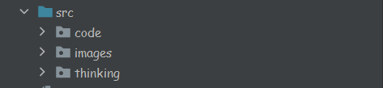

# leetCode练习
## 项目背景
每天练习1~2道题，记录自己做题的思路。不是每道题自己都会做，肯定会有参考题解的地方。记录下其他大佬的解题思路，也是检验自己对该题的掌握程度
温故而知新，可以为师矣！
## 工程结构

- code包中是代码
- think包中是解题思路
- 解题思路与代码以题号相互对应
# 现已经添加的标签名称
- [数组](src/code/Arrays)
- [数组相关解题思路](src/thinking/Arrays)
- [排序](src/code/Sort)
- [排序相关解题思路](src/thinking/Sort)
- [字符串](src/code/String)
- [字符串相关解题思路](src/thinking/String)
-
# Contributors
- Nirunfeng

