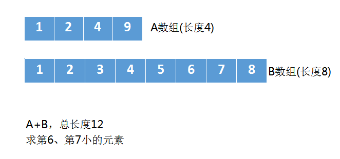
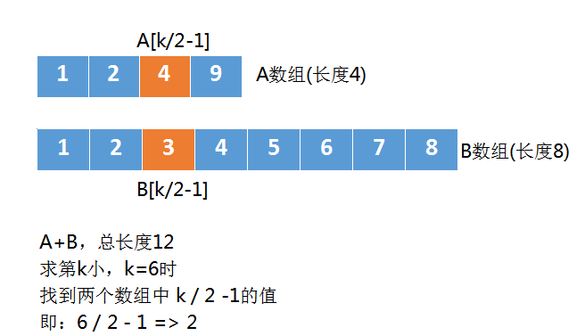

---
# 题号4：寻找两个正序数组的中位数
## 题目描述
> 给定两个大小分别为 m 和 n 的正序（从小到大）数组 nums1 和 nums2。请你找出并返回这两个正序数组的 中位数 。

> 示例1：
>> 输入：nums1 = [1,3], nums2 = [2]

>> 输出：2.00000

>> 解释：合并数组 = [1,2,3] ，中位数 2

> 示例2：
>> 输入：nums1 = [1,2], nums2 = [3,4]

>> 输出：2.50000

>> 解释：合并数组 = [1,2,3,4] ，中位数 (2 + 3) / 2 = 2.5

## 解题思路
---
```
首先明确一下中位数的定义：
    中位数（Median）又称中值，统计学中的专有名词，是按顺序排列的一组数据中居于中间位置的数，代表一个样本、种群或概率分布中的一个数值，其可将数值集合划分为相等的上下两部分。
```

给定两个有序的数组，求合并后数组的中位数，很容易我们能够联想到将两个数组的长度合并，然后求这个总长度的中位数即可。

如题目中两个数组长度分别为m，n，所以中位数的求法即为：(m+n)/2 [m+n为奇数],或者(m+2)/2、(m+n)/2+1[m+n为偶数]

于是这个问题就变成了求两个有序数组中第(m+n)/2大的数，或者(m+2)/2、(m+n)/2+1大的数。

---


如图，A+B的总长度为12，所以求中位数应该是第6小、第7小的元素之和/2.

---

于是，我们可以采用二分的思想：

- 第一次找第k小
- 第二次找第k/2小
- ...
- 直至k=1，便找到了该元素

---


由于A[k/2-1] > B[k/2-1]，这时候我们就可以忽略掉一些元素了。
上图中 A数组中的4，它前面有2个元素，也就是k/2-1个元素，B数组的3，它前面也有2个元素，也就是k/2-1个元素，所以橙色的4和3前面一共有k-2个元素。

假设 B数组的3，也就是B[k/2-1] 比这k-2个元素都大。
而 B[k/2-1] 是小于 A[k/2-1]的，那么B[k/2-1]相当于是第k-1小的，所以，第k小的元素肯定不是它。
这样的话，我们就可以排除一些元素了，刚才我们只是假设B[k/2-1] 比 A[k/2-1]前面的元素大，实际可能不是。
但有一点可以肯定，既然B[k/2-1]都不是第k小的元素，那么 B[k/2-1]前面的那些更不是了，于是我们将B[0]、B[1]、B[2]。。。B[k/2-1]这些元素全部忽略掉。

当我们忽略掉 B数组中的元素后， k也要跟着减小，原来我们求第6小，现在就是求第3小。
这个解法的整体求解过程，就是不断缩小数组的规模，同时把k也跟着缩小。


