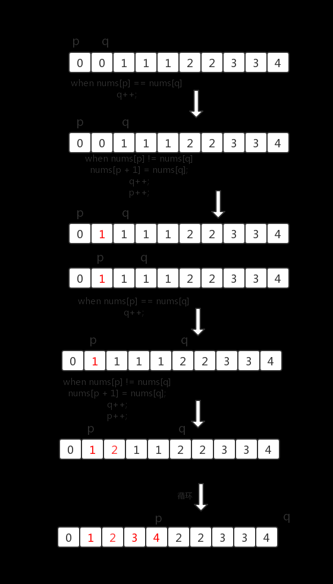

# 题号26. 删除有序数组中的重复项
## 题目描述
给你一个有序数组 nums ，请你 原地 删除重复出现的元素，使每个元素 只出现一次 ，返回删除后数组的新长度。

不要使用额外的数组空间，你必须在 原地 修改输入数组 并在使用 O(1) 额外空间的条件下完成。
说明:

为什么返回数值是整数，但输出的答案是数组呢?

请注意，输入数组是以「引用」方式传递的，这意味着在函数里修改输入数组对于调用者是可见的。

你可以想象内部操作如下
```
// nums 是以“引用”方式传递的。也就是说，不对实参做任何拷贝
int len = removeDuplicates(nums);

// 在函数里修改输入数组对于调用者是可见的。
// 根据你的函数返回的长度, 它会打印出数组中 该长度范围内 的所有元素。
for (int i = 0; i < len; i++) {
    print(nums[i]);
}
```
## 示例
示例1：
```
输入：nums = [1,1,2]
输出：2, nums = [1,2]
解释：函数应该返回新的长度 2 ，并且原数组 nums 的前两个元素被修改为 1, 2 。不需要考虑数组中超出新长度后面的元素。
```
示例2：
```
输入：nums = [0,0,1,1,1,2,2,3,3,4]
输出：5, nums = [0,1,2,3,4]
解释：函数应该返回新的长度 5 ， 并且原数组 nums 的前五个元素被修改为 0, 1, 2, 3, 4 。不需要考虑数组中超出新长度后面的元素。
```
提升：
```
0 <= nums.length <= 3 * 104
-104 <= nums[i] <= 104
nums 已按升序排列
```

## 解题思路
解题方法：双指针法
首先需要注意的是：数组是有序的，那么重复的元素一定会相邻。

要求删除重复元素，实际上就是将不重复的元素移到数组的左侧。

考虑用2个指针p和q，一个在前，一个在后。算法流程如下：
- 比较p和q位置的元素是否相等。
- 如果相等，q后移1位。
- 如果不相等，将q位置的元素复制到p+1位置上，p后移一位，q后移一位。
- 重复上述过程，直到q等于数组长度。
- 返回p+1即为新数组长度。

图解：



