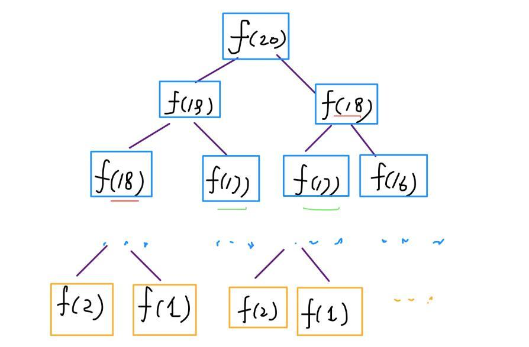
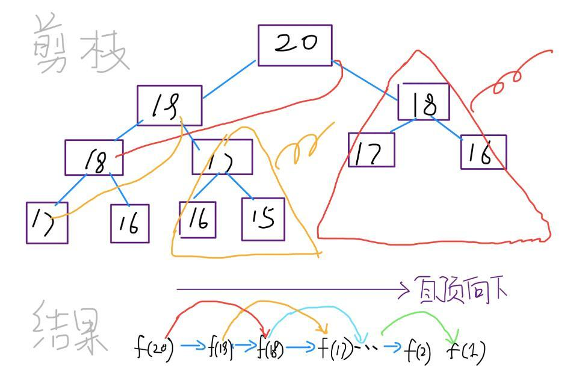
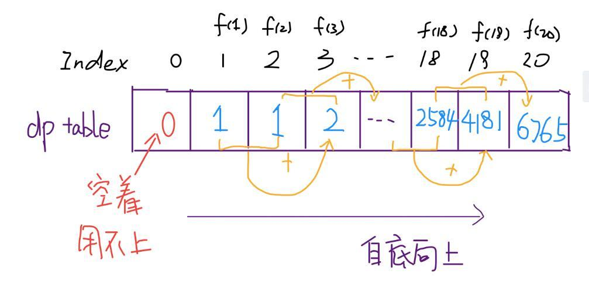
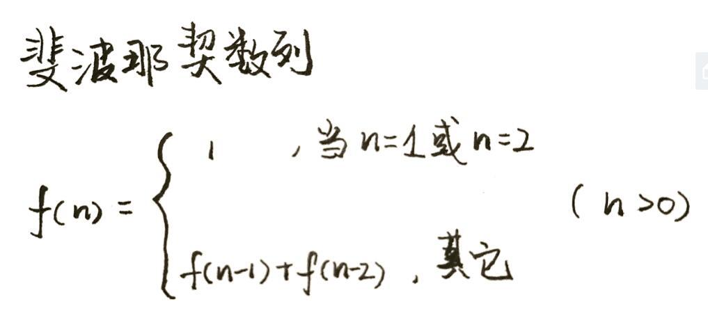

# 1. 动态规划套路详解

下面通过对斐波那契数列和这道凑零钱问题详解动态规划。如果只想看本题的答案，请直接翻到最后查看。

动态规划算法似乎是一种很高深莫测的算法，你会在一些面试或算法书籍的高级技巧部分看到相关内容，什么状态转移方程，重叠子问题，最优子结构等高大上的词汇也可能让你望而却步。

而且，当你去看用动态规划解决某个问题的代码时，你会觉得这样解决问题竟然如此巧妙，但却难以理解，你可能惊讶于人家是怎么想到这种解法的。

实际上，动态规划是一种常见的“算法设计技巧”，并没有什么高深莫测，至于各种高大上的术语，那是吓唬别人用的，只要你亲自体验几把，这些名词的含义其实显而易见，再简单不过了。

至于为什么最终的解法看起来如此精妙，是因为动态规划遵循一套固定的流程：递归的暴力解法 -> 带备忘录的递归解法 -> 非递归的动态规划解法。这个过程是层层递进的解决问题的过程，你如果没有前面的铺垫，直接看最终的非递归动态规划解法，当然会觉得牛逼而不可及了。

当然，见的多了，思考多了，是可以一步写出非递归的动态规划解法的。任何技巧都需要练习，我们先遵循这个流程走，算法设计也就这些套路，除此之外，真的没啥高深的。

以下，先通过两个个比较简单的例子：斐波那契和凑零钱问题，揭开动态规划的神秘面纱，描述上述三个流程。后续还会写几篇文章探讨如何使用动态规划技巧解决比较复杂的经典问题。

首先，第一个快被举烂了的例子，斐波那契数列。请读者不要嫌弃这个例子简单，因为简单的例子才能让你把精力充分集中在算法背后的通用思想和技巧上，而不会被那些隐晦的细节问题搞的莫名其妙。后续，困难的例子有的是。
# 步骤一、暴力的递归算法
```
int fib(int N) {
    if (N == 1 || N == 2) return 1;
    return fib(N - 1) + fib(N - 2);
}
```
这个不用多说了，学校老师讲递归的时候似乎都是拿这个举例。我们也知道这样写代码虽然简洁易懂，但是十分低效，低效在哪里？假设 n = 20，请画出递归树。


PS：但凡遇到需要递归的问题，最好都画出递归树，这对你分析算法的复杂度，寻找算法低效的原因都有巨大帮助。

这个递归树怎么理解？就是说想要计算原问题 f(20)，我就得先计算出子问题 f(19) 和 f(18)，然后要计算 f(19)，我就要先算出子问题 f(18) 和 f(17)，以此类推。最后遇到 f(1) 或者 f(2) 的时候，结果已知，就能直接返回结果，递归树不再向下生长了。

递归算法的时间复杂度怎么计算？子问题个数乘以解决一个子问题需要的时间。

子问题个数，即递归树中节点的总数。显然二叉树节点总数为指数级别，所以子问题个数为 O(2^n)。

解决一个子问题的时间，在本算法中，没有循环，只有 f(n - 1) + f(n - 2) 一个加法操作，时间为 O(1)。

所以，这个算法的时间复杂度为 O(2^n)，指数级别，爆炸。

观察递归树，很明显发现了算法低效的原因：存在大量重复计算，比如 f(18) 被计算了两次，而且你可以看到，以 f(18) 为根的这个递归树体量巨大，多算一遍，会耗费巨大的时间。更何况，还不止 f(18) 这一个节点被重复计算，所以这个算法及其低效。

这就是动态规划问题的第一个性质：重叠子问题。下面，我们想办法解决这个问题。
# 步骤二、带备忘录的递归解法
明确了问题，其实就已经把问题解决了一半。即然耗时的原因是重复计算，那么我们可以造一个「备忘录」，每次算出某个子问题的答案后别急着返回，先记到「备忘录」里再返回；每次遇到一个子问题先去「备忘录」里查一查，如果发现之前已经解决过这个问题了，直接把答案拿出来用，不要再耗时去计算了。

一般使用一个数组充当这个「备忘录」，当然你也可以使用哈希表（字典），思想都是一样的。
```
int fib(int N) {
    if (N < 1) return 0;
    // 备忘录全初始化为 0
    vector<int> memo(N + 1, 0);
    return helper(memo, N);
}
int helper(vector<int>& memo, int n) {
    if (n == 1 || n == 2) return 1;
    if (memo[n] != 0) return memo[n];
    // 未被计算过
    memo[n] = helper(memo, n - 1) + helper(memo, n - 2);
    return memo[n];
}
```
现在，画出递归树，你就知道「备忘录」到底做了什么



实际上，带「备忘录」的递归算法，把一棵存在巨量冗余的递归树通过「剪枝」，改造成了一幅不存在冗余的递归图，极大减少了子问题（即递归图中节点）的个数。

递归算法的时间复杂度怎么算？子问题个数乘以解决一个子问题需要的时间。

子问题个数，即图中节点的总数，由于本算法不存在冗余计算，子问题就是 f(1), f(2), f(3) … f(20)，数量和输入规模 n = 20 成正比，所以子问题个数为 O(n)。

解决一个子问题的时间，同上，没有什么循环，时间为 O(1)。

所以，本算法的时间复杂度是 O(n)。比起暴力算法，是降维打击。

至此，带备忘录的递归解法的效率已经和动态规划一样了。实际上，这种解法和动态规划的思想已经差不多了，只不过这种方法叫做「自顶向下」，动态规划叫做「自底向上」。

啥叫「自顶向下」？注意我们刚才画的递归树（或者说图），是从上向下延伸，都是从一个规模较大的原问题比如说 f(20)，向下逐渐分解规模，直到 f(1) 和 f(2) 触底，然后逐层返回答案，这就叫「自顶向下」。

啥叫「自底向上」？反过来，我们直接从最底下，最简单，问题规模最小的 f(1) 和 f(2) 开始往上推，直到推到我们想要的答案 f(20)，这就是动态规划的思路，这也是为什么动态规划一般都脱离了递归，而是由循环迭代完成计算。

步骤三、动态规划
有了上一步「备忘录」的启发，我们可以把这个「备忘录」独立出来成为一张表，就叫做 DP table 吧，在这张表上完成「自底向上」的推算岂不美哉！
```
int fib(int N) {
    vector<int> dp(N + 1, 0);
    dp[1] = dp[2] = 1;
    for (int i = 3; i <= N; i++)
        dp[i] = dp[i - 1] + dp[i - 2];
    return dp[N];
}
```

画个图就很好理解了，而且你发现这个 DP table 特别像之前那个「剪枝」后的结果，只是反过来算而已。实际上，带备忘录的递归解法中的「备忘录」，最终完成后就是这个 DP table，所以说这两种解法其实是差不多的，大部分情况下，效率也基本相同。

这里，引出 「动态转移方程」 这个名词，实际上就是描述问题结构的数学形式：

为啥叫「状态转移方程」？为了听起来高端。你把 f(n) 想做一个状态 n，这个状态 n 是由状态 n - 1 和状态 n - 2 相加转移而来，这就叫状态转移，仅此而已。

你会发现，上面的几种解法中的所有操作，例如 return f(n - 1) + f(n - 2)，dp[i] = dp[i - 1] + dp[i - 2]，以及对备忘录或 DP table 的初始化操作，都是围绕这个方程式的不同表现形式。可见列出「状态转移方程」的重要性，它是解决问题的核心。很容易发现，其实状态转移方程直接代表着暴力解法。

千万不要看不起暴力解，动态规划问题最困难的就是写出状态转移方程，即这个暴力解。优化方法无非是用备忘录或者 DP table，再无奥妙可言。

这个例子的最后，讲一个细节优化。细心的读者会发现，根据斐波那契数列的状态转移方程，当前状态只和之前的两个状态有关，其实并不需要那么长的一个 DP table 来存储所有的状态，只要想办法存储之前的两个状态就行了。所以，可以进一步优化，把空间复杂度降为 O(1)：
```
int fib(int n) {
    if (n < 2) return n;
    int prev = 0, curr = 1;
    for (int i = 0; i < n - 1; i++) {
        int sum = prev + curr;
        prev = curr;
        curr = sum;
    }
    return curr;
}
```
有人会问，动态规划的另一个重要特性「最优子结构」，怎么没有涉及？下面会涉及。斐波那契数列的例子严格来说不算动态规划，以上旨在演示算法设计螺旋上升的过程。当问题中要求求一个最优解或在代码中看到循环和 max、min 等函数时，十有八九，需要动态规划大显身手。

# 解决博弈问题的动态规划通用思路
但是智力题终究是智力题，真正的算法问题肯定不会是投机取巧能搞定的。所以，本文就借石头游戏来讲讲「假设两个人都足够聪明，最后谁会获胜」这一类问题该如何用动态规划算法解决。

博弈类问题的套路都差不多，下文举例讲解，其核心思路是在二维 dp 的基础上使用元组分别存储两个人的博弈结果。掌握了这个技巧以后，别人再问你什么俩海盗分宝石，俩人拿硬币的问题，你就告诉别人：我懒得想，直接给你写个算法算一下得了。

我们「石头游戏」改的更具有一般性：

你和你的朋友面前有一排石头堆，用一个数组 piles 表示，piles[i] 表示第 i 堆石子有多少个。你们轮流拿石头，一次拿一堆，但是只能拿走最左边或者最右边的石头堆。所有石头被拿完后，谁拥有的石头多，谁获胜。

石头的堆数可以是任意正整数，石头的总数也可以是任意正整数，这样就能打破先手必胜的局面了。比如有三堆石头 piles = [1, 100, 3]，先手不管拿 1 还是 3，能够决定胜负的 100 都会被后手拿走，后手会获胜。

假设两人都很聪明，请你设计一个算法，返回先手和后手的最后得分（石头总数）之差。比如上面那个例子，先手能获得 4 分，后手会获得 100 分，你的算法应该返回 -96。

这样推广之后，这个问题算是一道 Hard 的动态规划问题了。博弈问题的难点在于，两个人要轮流进行选择，而且都贼精明，应该如何编程表示这个过程呢？

还是强调多次的套路，首先明确 dp 数组的含义，然后和股票买卖系列问题类似，只要找到「状态」和「选择」，一切就水到渠成了。
## 一、定义 dp 数组的含义
定义 dp 数组的含义是很有技术含量的，同一问题可能有多种定义方法，不同的定义会引出不同的状态转移方程，不过只要逻辑没有问题，最终都能得到相同的答案。

我建议不要迷恋那些看起来很牛逼，代码很短小的奇技淫巧，最好是稳一点，采取可解释性最好，最容易推广的设计思路。本文就给出一种博弈问题的通用设计框架。

介绍 dp 数组的含义之前，我们先看一下 dp 数组最终的样子：
```
dp[i][j].fir = max(piles[i] + dp[i+1][j].sec, piles[j] + dp[i][j-1].sec)
dp[i][j].fir = max(选择最左边的石头堆, 选择最右边的石头堆)
 # 解释：我作为先手，面对 piles[i...j] 时，有两种选择：
 # 要么我选择最左边的那一堆石头，然后面对 piles[i+1...j]
 # 但是此时轮到对方，相当于我变成了后手；
 # 要么我选择最右边的那一堆石头，然后面对 piles[i...j-1]
 # 但是此时轮到对方，相当于我变成了后手。

if 先手选择左边:
dp[i][j].sec = dp[i+1][j].fir
if 先手选择右边:
dp[i][j].sec = dp[i][j-1].fir
# 解释：我作为后手，要等先手先选择，有两种情况：
# 如果先手选择了最左边那堆，给我剩下了 piles[i+1...j]
# 此时轮到我，我变成了先手；
# 如果先手选择了最右边那堆，给我剩下了 piles[i...j-1]
# 此时轮到我，我变成了先手。
```
根据 dp 数组的定义，我们也可以找出 base case，也就是最简单的情况：
```
dp[i][j].fir = piles[i]
dp[i][j].sec = 0
其中 0 <= i == j < n
# 解释：i 和 j 相等就是说面前只有一堆石头 piles[i]
# 那么显然先手的得分为 piles[i]
# 后手没有石头拿了，得分为 0
```