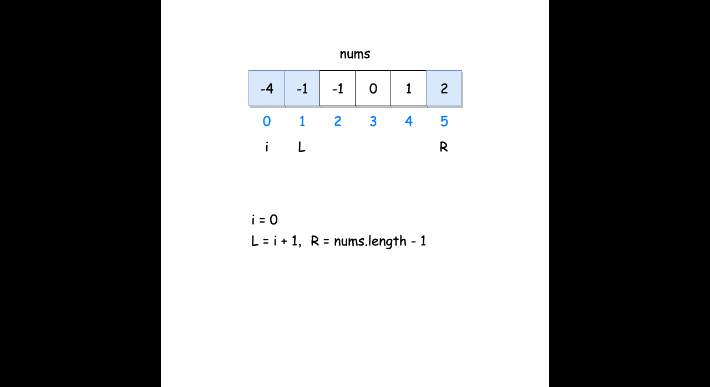

# 15.三数之和

## 题目描述

给你一个包含 n 个整数的数组 nums，判断 nums 中是否存在三个元素 a，b，c ，使得 a + b + c = 0 ？请你找出所有和为 0 且不重复的三元组。

## 示例
### 示例1：
```
    输入：nums = [-1,0,1,2,-1,-4]
    输出：[[-1,-1,2],[-1,0,1]
```
### 示例2：
```
    输入：nums = []
    输出：[]
```
## 解题思路
- 首先要对长度为n的数组进行排序
- 判断n的值，0<=n<3时无结果
- 排序后固定一个数 nums[i]，再使用左右指针指向 nums[i]后面的前和后两端(ps：图片)，数字分别为 nums[L]和 nums[R]，计算三个数的和 sum 判断是否满足为 0，满足则添加进结果集
- 如果 nums[i]大于 0，则三数之和必然无法等于 0，结束循环
- 如果nums[i] == nums[i-1]，则说明该数字重复，会导致结果重复，所以应该跳过
- 当 sum == 0 时，nums[L] == nums[L+1] 则会导致结果重复，应该跳过，L++
- 当 sum == 0 时，nums[R]] == nums[R-1]则会导致结果重复，应该跳过，R--


