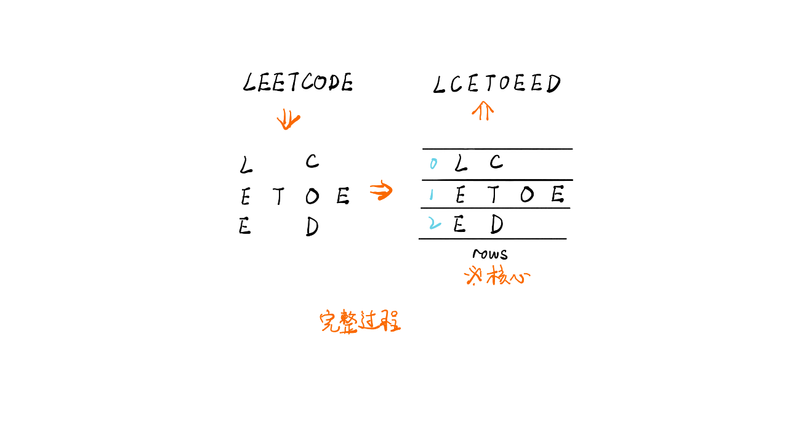

# 题号6.Z字形变换
## 题目描述
将一个给定字符串 s 根据给定的行数 numRows ，以从上往下、从左到右进行 Z 字形排列。

比如输入字符串为 "PAYPALISHIRING" 行数为 3 时，排列如下：
```
P   A   H   N
A P L S I I G
Y   I   R
```
之后，你的输出需要从左往右逐行读取，产生出一个新的字符串，比如："PAHNAPLSIIGYIR"。

请你实现这个将字符串进行指定行数变换的函数：
```
string convert(string s, int numRows);
```
## 示例
示例1：
```
输入：s = "PAYPALISHIRING", numRows = 3
输出："PAHNAPLSIIGYIR"
```
示例2：
```
输入：s = "PAYPALISHIRING", numRows = 4
输出："PINALSIGYAHRPI"
解释：
P     I    N
A   L S  I G
Y A   H R
P     I
```
示例3：
```
输入：s = "A", numRows = 1
输出："A"
```
## 解题思路

整体的解题思路采用排序的思想，我们根据给定的字符串s和规定的行数rows，根据要求进行遍历，即向下向右...。最后将遍历的结果输出。

- 边界判断：若rows=1，则无需遍历，直接返回s
- 声明line=0，line<row，line++，从s中拿出一个放入新的数组(每行都是一个数组，最后合并)
图解如下：


