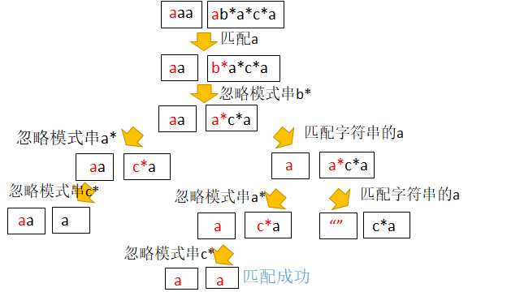

# 题号10.正则表达式匹配
## 题目描述
给你一个字符串 s 和一个字符规律 p，请你来实现一个支持 '.' 和 '*' 的正则表达式匹配。

- '.' 匹配任意单个字符
- '*' 匹配零个或多个前面的那一个元素

所谓匹配，是要涵盖 整个 字符串 s的，而不是部分字符串。
## 示例
示例1：
```
输入：s = "aa" p = "a"
输出：false
解释："a" 无法匹配 "aa" 整个字符串。
```
示例2：
```
输入：s = "aa" p = "a*"
输出：true
解释：因为 '*' 代表可以匹配零个或多个前面的那一个元素, 在这里前面的元素就是 'a'。因此，字符串 "aa" 可被视为 'a' 重复了一次。
```
示例3：
```
输入：s = "ab" p = ".*"
输出：true
解释：".*" 表示可匹配零个或多个（'*'）任意字符（'.'）。
```
示例4：
```
输入：s = "aab" p = "c*a*b"
输出：true
解释：因为 '*' 表示零个或多个，这里 'c' 为 0 个, 'a' 被重复一次。因此可以匹配字符串 "aab"。
```
示例5：
```
输入：s = "mississippi" p = "mis*is*p*."
输出：false
```
## 解题思路
采用递归思想解决该题：
- 递归构造：
- 单个匹配，如果两个字符相同，或者模式串当前是万能字符.，则匹配成功，然后继续递归比较 s[i + 1:] 和p[i + 1:]
- 如果模式串后面跟了"*"，这又分为两种情况：
- (1)如果s[i]和p[i]不等(比如aa和b*这种情况)，则将b*忽略掉，也就是继续递归比较s和p[i + 2:]
- (2)如果p[i]和s[i]相等(比如aa和a*这种情况)，我们可以选择忽略a*，也就是执行(1)，也可以将字符串中的a忽略掉，继续递归比较s[i + 1:]和p


